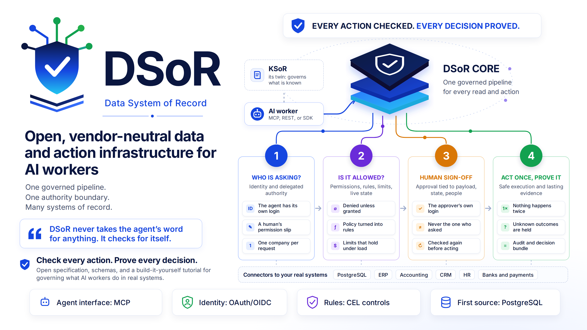

<p align="center">
  
</p>

# DSoR — Data System of Record

**The governed layer between an AI worker and a company's real systems.**

A company does not hand a new accounts clerk the bank password and say "pay whatever
looks right." The clerk gets a login of their own, a list of what they may do, a
spending limit, a manager who signs off on large payments, and a logbook.

An AI agent that works inside a company — a *Digital FTE* — needs the same treatment,
and more, because an agent can be confidently wrong, can be tricked by text it reads,
and retries things a person would not. DSoR is the layer that stands between the agent
and the accounting system, the ERP, and the database. It makes sure the agent can only
do what it is allowed to do, that large actions get a human's sign-off, that nothing
happens twice by accident, and that there is proof of everything afterwards.

**DSoR never takes the agent's word for anything. It checks for itself.**

**DSoR has a twin.** [KSoR — the Knowledge System of Record](https://github.com/panaversity/ksor)
— is the governed record of what the organization officially knows: its policies,
procedures, and definitions. KSoR tells an AI worker how the organization operates.
DSoR checks the facts for itself, carries out the action safely, and keeps the evidence.
An AI worker needs both. See
[DSoR and KSoR](#dsor-and-ksor-twin-systems-of-record-for-ai-workers).

## Where it fits

| Part | In the clerk analogy | Its job |
| --- | --- | --- |
| [KSoR](https://github.com/panaversity/ksor) — Knowledge System of Record | The company handbook | KNOW |
| Context store (by default: [Graphiti](https://github.com/getzep/graphiti) for memory, [OpenViking](https://github.com/volcengine/OpenViking) for skills and files) | The clerk's notebook | REMEMBER |
| Agent runtime | The clerk's brain | REASON |
| **DSoR** — this repository | The company's systems, the desk that checks permissions and sign-offs, and the logbook | STATE + ACT |

## DSoR and KSoR: twin systems of record for AI workers

Before a company lets a new employee work alone, it gives them two things. It gives
them **the handbook**: the policies and procedures that say how things are done here.
And it gives them **the desk that controls the systems**: a login, a list of what they
may do, a spending limit, a manager who signs off on large actions, and a logbook.

An AI worker needs the same two things.

- **[KSoR](https://github.com/panaversity/ksor) is the handbook, governed.** It is the
  authority on what the organization knows, requires, and prescribes.
- **DSoR is the desk, governed.** It is the authority on what is true right now in the
  company's systems, and on what the worker may do there.

They are twins: born of the same idea, built on the same principles, and meant to serve
an AI worker together.

> **KSoR governs what an AI worker may _know_. DSoR governs what it may _do_.**

### The same principles, applied to two different things

|  | KSoR | DSoR |
| --- | --- | --- |
| Authority on | Institutional knowledge | Operational state, and the actions taken on it |
| The question it answers | What do we know, and how should we operate? | What is true right now, and what may safely be done? |
| Holds | Policies, procedures, standards, definitions, decision criteria | A governed door to invoices, payments, vendors, balances, approvals |
| How it changes | Review, approval by an authorized person, versioning | Commands through one fixed checklist: who, authority, rules, approval, evidence |
| When it says no | It **abstains**: the record does not contain enough to answer | It **refuses, or waits for a human**: no authority, or a rule demands approval |
| What it can prove | Which document, version, and publication an answer came from | Who asked, under whose authority, which rules ran, who approved, what happened |
| Agent surface | MCP: `search`, `outline`, `read` | MCP: one tool for each governed operation |
| Trusts the model? | No. Authority comes from the governed record | No. Authority comes from its own checks |

### Where they meet: a policy becomes a control

A policy is a sentence, and software cannot enforce a sentence.

The company's policy says: *payments above 25,000 USD need the CFO's approval.* That
sentence lives in the KSoR, with an owner, an approval, and a version number. In DSoR, a
human turns it into a **control**: a small rule a program can check, attached to the
`payment.execute` operation. The control records exactly which KSoR document, which
version, and which fingerprint of the text it was built from
([§17](specs/dsor/02-security.md#17-policy-compilation-from-authority-to-control)).

```text
KSoR   policy     "Payments above 25,000 USD need the CFO's approval."      version 4, approved
          │
          │  one human compiles it, another human reviews it
          ▼
DSoR   control    high-value-payment: amount exceeds 25,000 USD             built from version 4
                  → REQUIRE_APPROVAL(CFO)
          │
          ▼
       an action  PAY-901, 31,400 USD, waits until cfo_100 approves from her own login
```

When an auditor asks "why did the system allow this?", you can walk from the action, to
the control, to the exact policy sentence and version. When the policy changes in the
KSoR, the specification requires DSoR to mark the control *stale* and tell its owner. A
stale control is never quietly switched off.

Neither twin crosses the line between them
([§4](specs/dsor/01-model.md#4-authority-boundaries-and-precedence)):

- **KSoR never decides whether an action is permitted.** It says what the policy is.
- **DSoR never decides what the policy is.** It enforces what was approved, and points
  back to it.
- **The agent's memory decides nothing.** For knowledge, KSoR wins. For current state,
  DSoR wins. Memory only helps the agent decide where to look.

### Independent, and better together

Neither twin requires the other. DSoR names KSoR as its default source of policy, and
accepts any governed source in its place; every rule in the specification is
vendor-neutral. KSoR is complete with no DSoR beside it.

Together they give an AI worker the two things no model can supply for itself: **what is
authoritative to know, and what is authorized to do.**

KSoR is the older twin. Its command-line tool is published as `@panaversity/ksor`, and
its own status page says exactly which parts are released. DSoR is younger, as the next
section says plainly. No code connects the two yet, and how DSoR learns that a
KSoR policy has a new version is still an
[open question](research/open-questions.md).

## Status

This repository currently holds the **[specification, v1.4.0](https://github.com/panaversity/dsor/blob/main/docs/original_specs/DSoR_Specification_v1_4_0_Learners_Edition.md)**, its machine-readable
half, a tested toolchain, and the first step of a build-it-yourself tutorial. **The
reference implementation has not been started.**
[`docs/status.md`](docs/status.md) is the only authority on what is built.

## Start here

| You are… | Go to |
| --- | --- |
| New to all of this | [`docs/learn/start-here.md`](docs/learn/start-here.md) — fifteen minutes, no prior knowledge assumed |
| A student who wants to build it | [`docs/baby_steps_tutorials/`](docs/baby_steps_tutorials/readme.md) — DSoR in 52 baby steps, built with Claude Code. The short map is [`docs/learn/learning-path.md`](docs/learn/learning-path.md) |
| Checking what you learned | [`docs/learn/questions.md`](docs/learn/questions.md) — 23 questions with answers |
| Reading the specification | [`specs/dsor/README.md`](specs/dsor/README.md) |
| Writing a conformance test | [`packages/spec/requirements.json`](packages/spec/requirements.json) — 268 requirements, one MUST each |
| A coding agent, or working with one | [`AGENTS.md`](AGENTS.md) |

## Learn by building: the baby steps

The best way to understand DSoR is to build it. The
[baby steps tutorial](docs/baby_steps_tutorials/readme.md) builds a working DSoR in 52
small, numbered steps. Each step adds **one new idea**, lives in its own folder, and
starts as a copy of the step before it, so you never meet two new things on the same
day. The technology arrives slowly: plain TypeScript first, then PostgreSQL on
[Neon](https://neon.com/), then rules and approvals, then a bank that sometimes does
not answer, then [Better Auth](https://better-auth.com/) and an MCP server, and at the
end a complete digital employee. Every step is built with Claude Code, has a "break it"
exercise that shows you the failure its rule prevents, and carries tests named after
the rules of the specification. **Step 00,
[the foundation](docs/baby_steps_tutorials/00_foundation/README.md), is ready; steps 01
to 51 are planned.** Start there after the fifteen-minute
[Start here](docs/learn/start-here.md) chapter.

## What is in the repository

```text
specs/dsor/        the specification, in seven parts and two appendices
packages/spec/     JSON Schemas, validated examples, the requirement registry, and their tests
packages/dsor/     the reference implementation (not started)
docs/learn/        start here · learning path · questions and answers
docs/baby_steps_tutorials/   DSoR in 52 baby steps; one self-contained folder per step
docs/status.md     what is implemented
research/          how the specification got here, and what is still open
.claude/           Claude Code settings, skills, and a reviewer subagent
```

## Run the checks

```bash
corepack enable          # or: npm install -g pnpm
pnpm install
pnpm check               # spec guard, lint, format, typecheck, tests
```

`pnpm check` proves that every example validates against its schema, that the schemas
reject what the specification says they reject, that the `high-value-payment` control
passes its own test vectors in a real CEL evaluator, and that every one of the 268
requirements holds exactly one MUST.

Try one thing: open `packages/spec/src/control-cel.test.ts` and find the test named
*"the naive condition lets 50,000,000 PKR through"*. It shows a rule that looks
correct and is not, and the specification's fix.

## Developing with Claude Code

This is also the repository DSoR is built in, with Claude Code. `CLAUDE.md` imports
`AGENTS.md`, so every agent reads one contract. Three skills carry the working
discipline — `implement-spec`, `change-the-spec`, `write-for-learners` — and a
read-only `requirement-reviewer` subagent gives a hostile pass before work is called
done. Start a session and say which stage of the learning path you are on.

The baby steps work a little differently. Each step folder carries its own `CLAUDE.md`
and its own `build-baby-step` skill, so you start Claude Code **inside the step's
folder**, and the agent writes only there. The
[tutorial overview](docs/baby_steps_tutorials/readme.md#build-the-steps-with-claude-code)
has the directions and the prompts.

## Contributing, security, license

See [`CONTRIBUTING.md`](CONTRIBUTING.md) and [`SECURITY.md`](SECURITY.md). Licensed
under [Apache-2.0](LICENSE). Copyright 2026 Panaversity.
